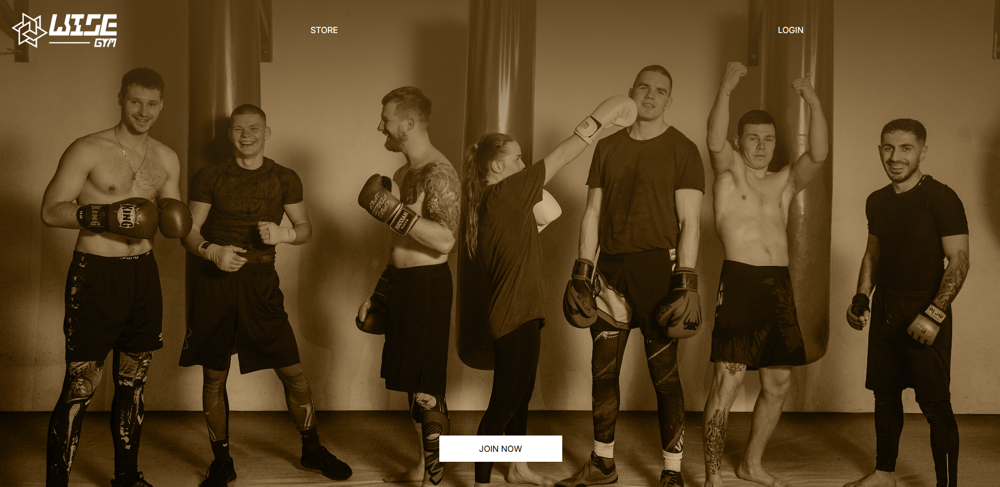
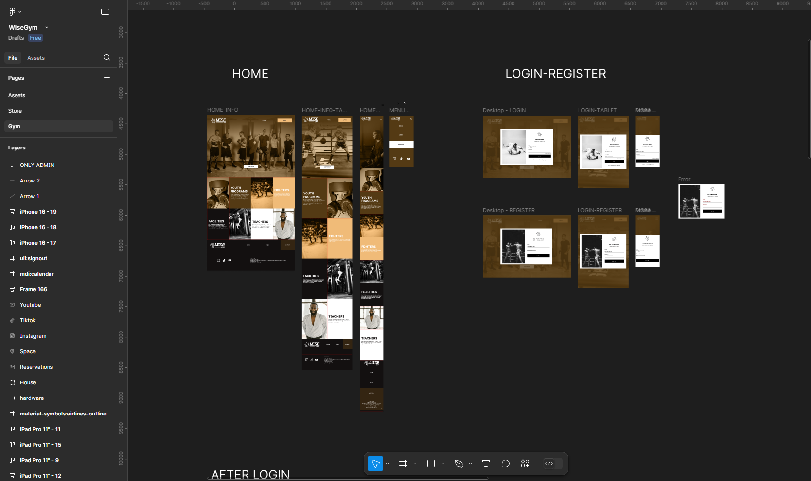
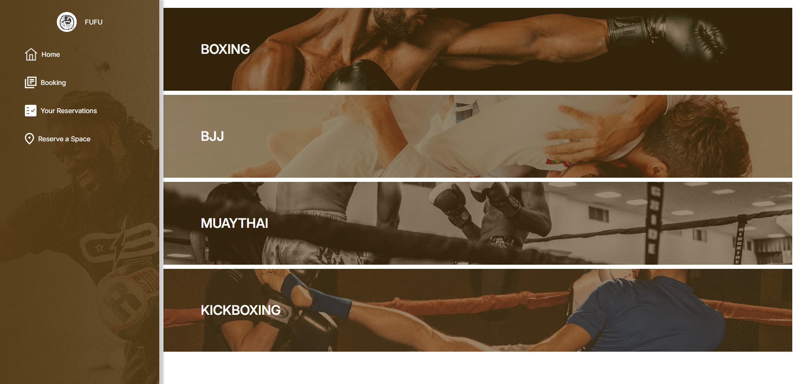

# WiseGym

    

## Vista en vivo

<ul>
    <li>
        <a target="https://wise-gym-react.vercel.app" href="">Vista en vivo</a>
    </li>
</ul>

## Descripción 📑

Aplicacion web para un gimnasio para poder reservar clases y gestionar una suscripcion 

## ¿Qué he aprendido en este proyecto? 🙇🏻

Este proyecto es una aplicación web de un gimnasio desarrollada con React, donde gestioné información utilizando MongoDB como base de datos y Firebase para el sistema de autenticación.

🔹 Tecnologías y herramientas utilizadas:

React: Desarrollo de la interfaz con componentes reutilizables y hooks.

MongoDB: Almacenamiento y gestión de la información del gimnasio.

Firebase: Implementación del sistema de login y autenticación.

react-hook-form: Manejo eficiente de formularios.

Figma & Photoshop: Diseño UI/UX y recursos gráficos.

Este proyecto me permitió profundizar en la integración de bases de datos con React, el uso de autenticación segura y la optimización de formularios con librerías especializadas. 🚀

## Tecnologías 🛠

<!-- Iconos sacados de: https://github.com/alexandresanlim/Badges4-README.md-Profile?tab=readme-ov-file#-languages- -->

    

## Capturas del proyecto

   
   
   

## Autor ✒️

**Juan Goncalves**

<ul>
    <li>
        <a href="jagoncalvesrodrigues@gmail.com">jagoncalvesrodrigues@gmail.com</a>
    </li>
    <li>
        <a href="https://www.linkedin.com/in/juanantoniogoncalvesrodrigues/">LinkedIn</a>
    </li>
    <li>
        <a href="https://client-tan-delta.vercel.app">Porfolio web</a>
    </li>
</ul>

## Instalación

Este proyecto está construido con Vite.

- Para editarlo ejecuta el comando <b>npm run dev</b>
- Para construir la versión de producción ejecuta el comando <b>npm run build</b>
- Para previsualizar la versión final ejecuta el comando <b>npm run preview</b>
README.md
Mostrando README.md.
